# School management

How to use:

## Step 1: clone repository

## Step 2: execute command to install packages dependencies

```sh
npm install
```

## Step 3: Compile and Hot-Reload for Development

```sh
npm run dev
```

## If want to build app
Compile and Minify for Production

```sh
npm run build
```

### This is [source code](https://github.com/genson1808/qlth-be) for back-end


# Feature 
## view, paging 
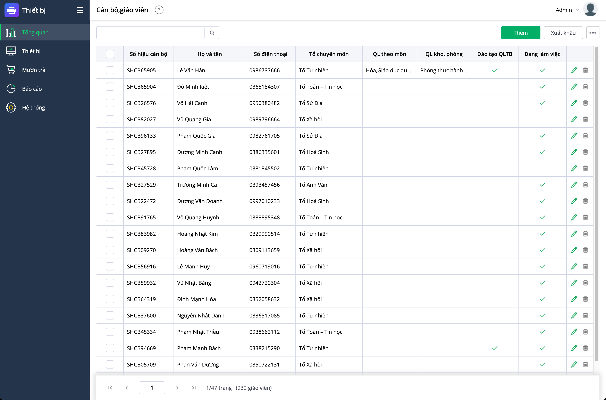
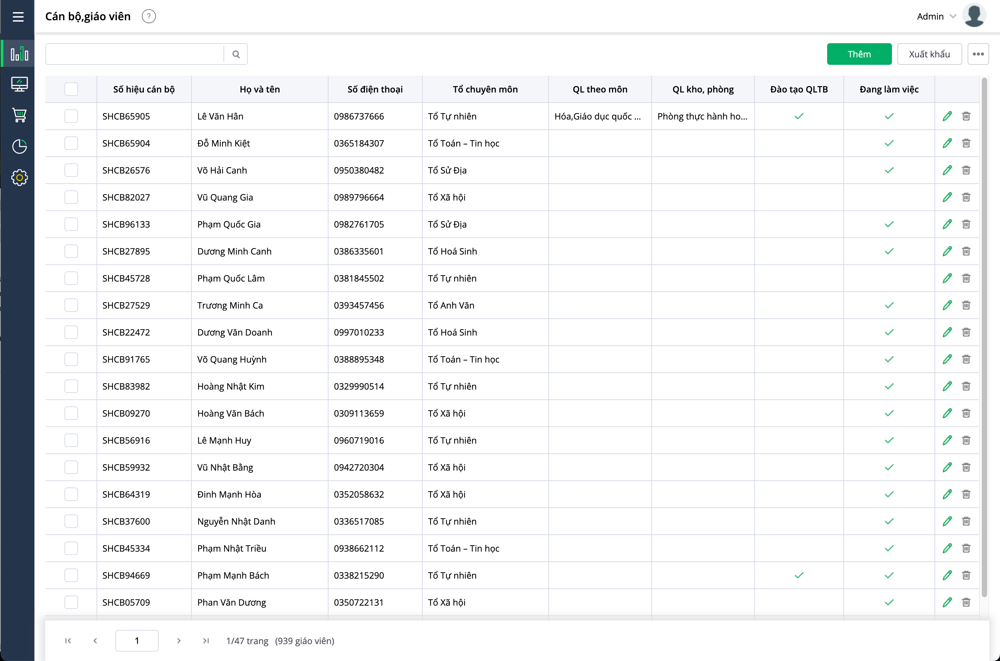

## seach employe by name
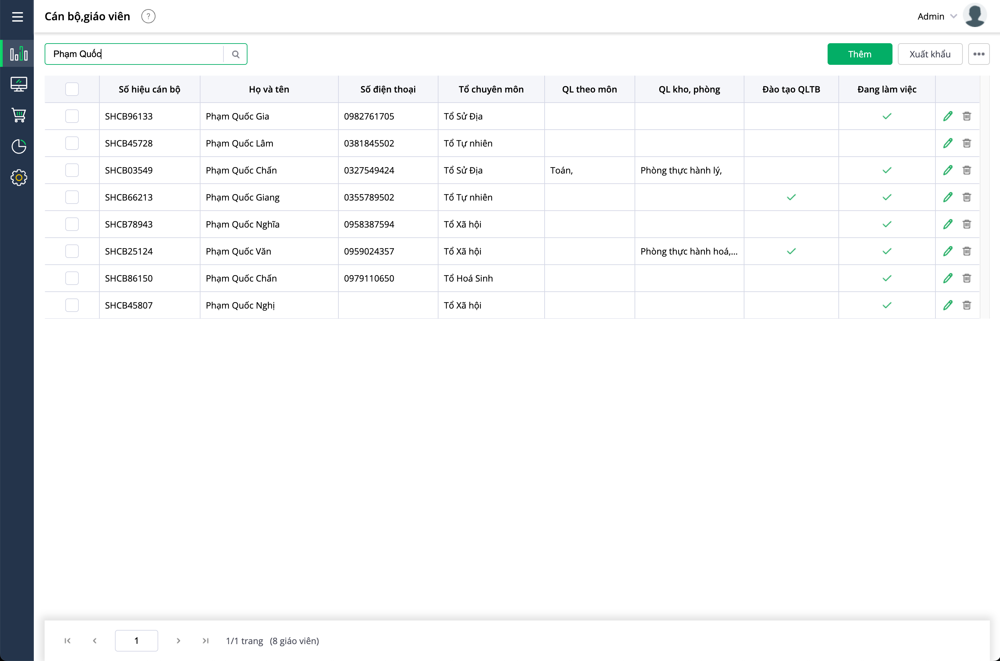

## search employee by phone
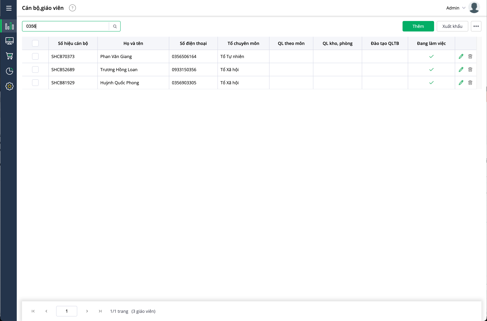

## add employee 
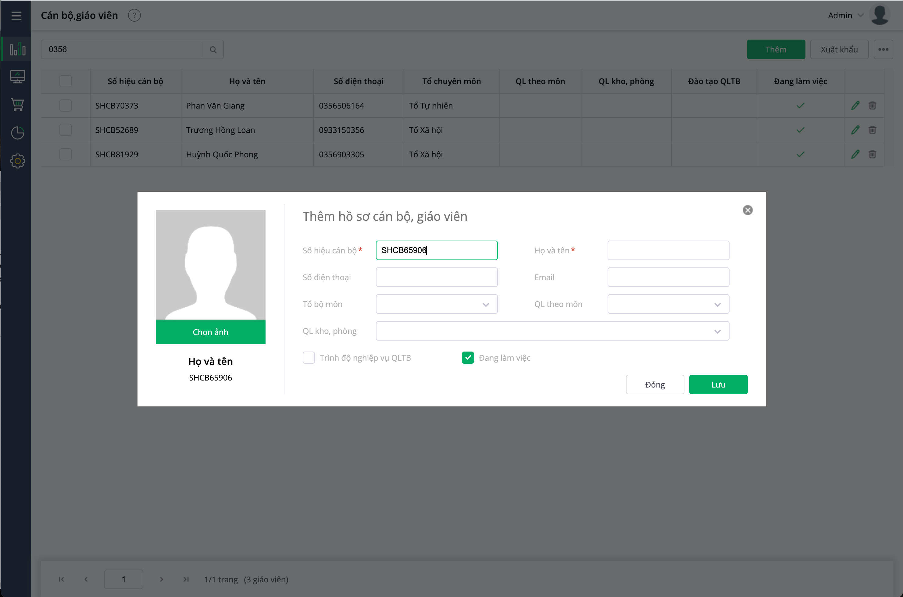

## edit employee 
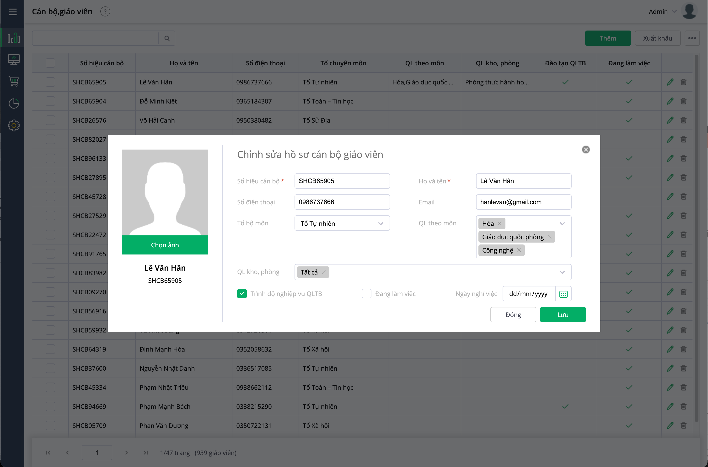
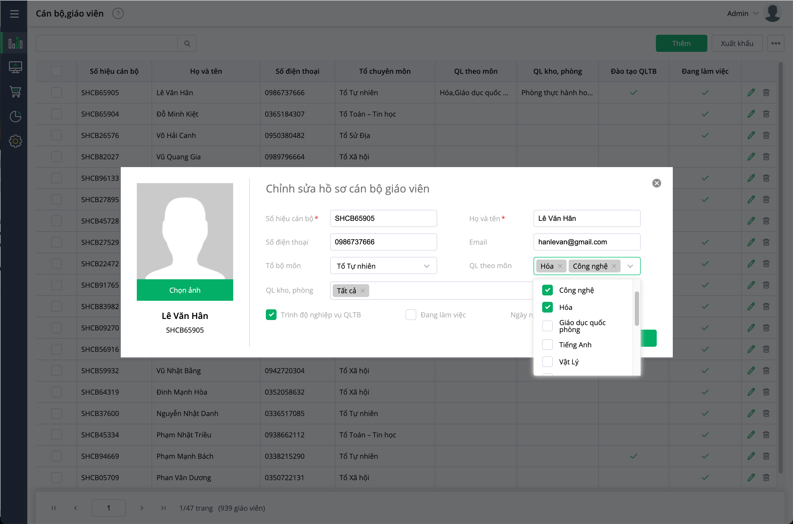


## validate 
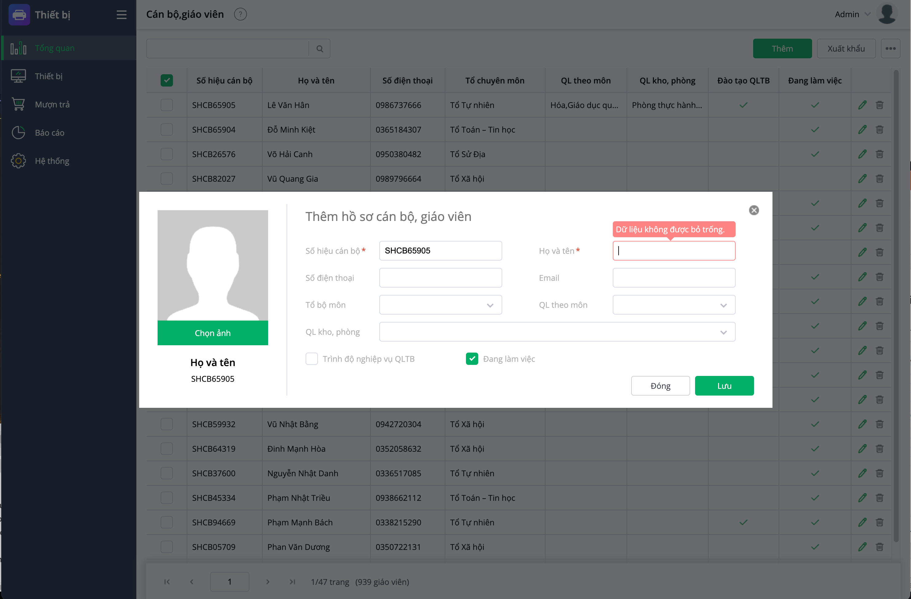
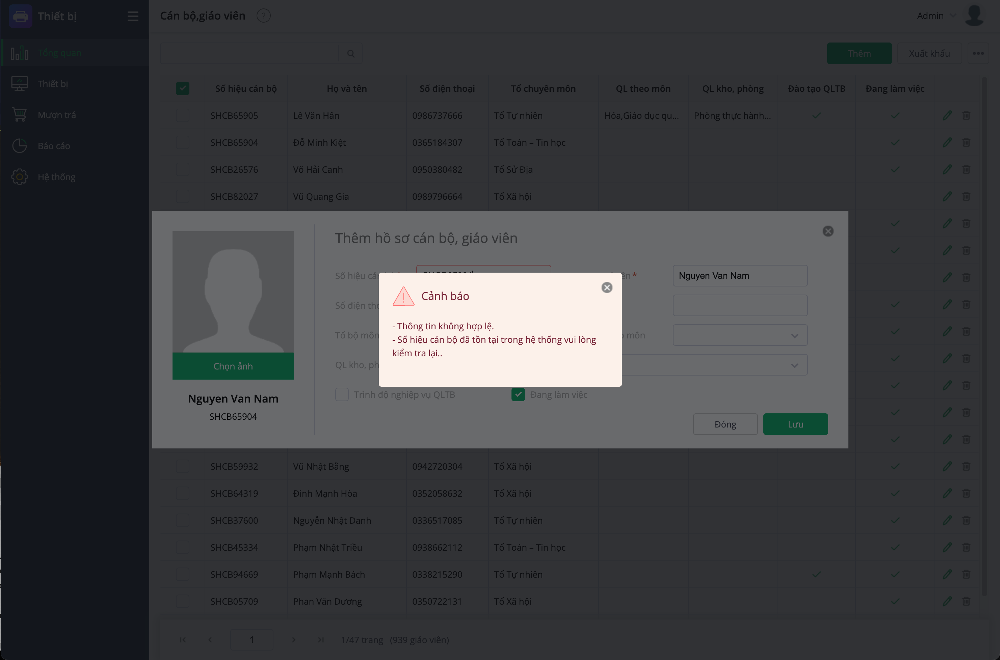
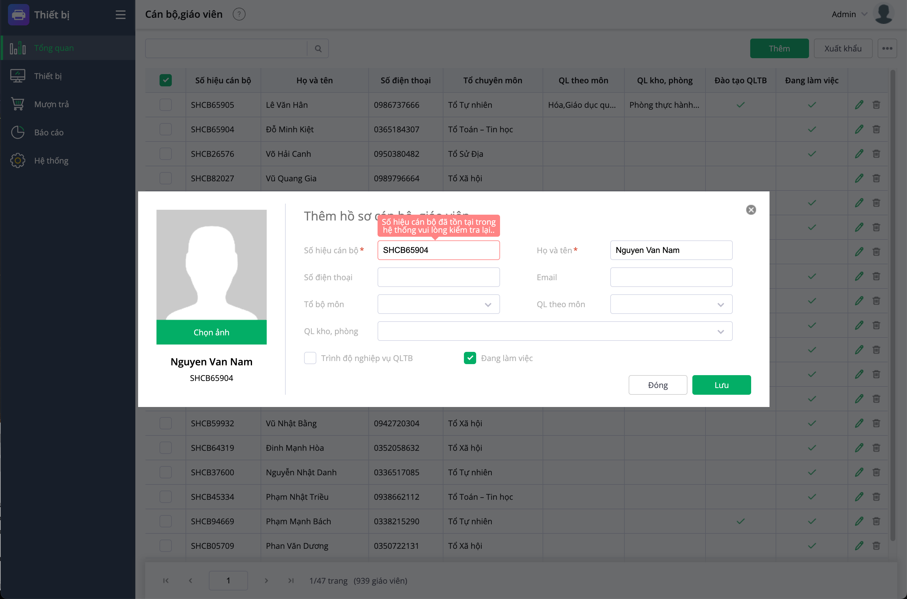

# export to excel
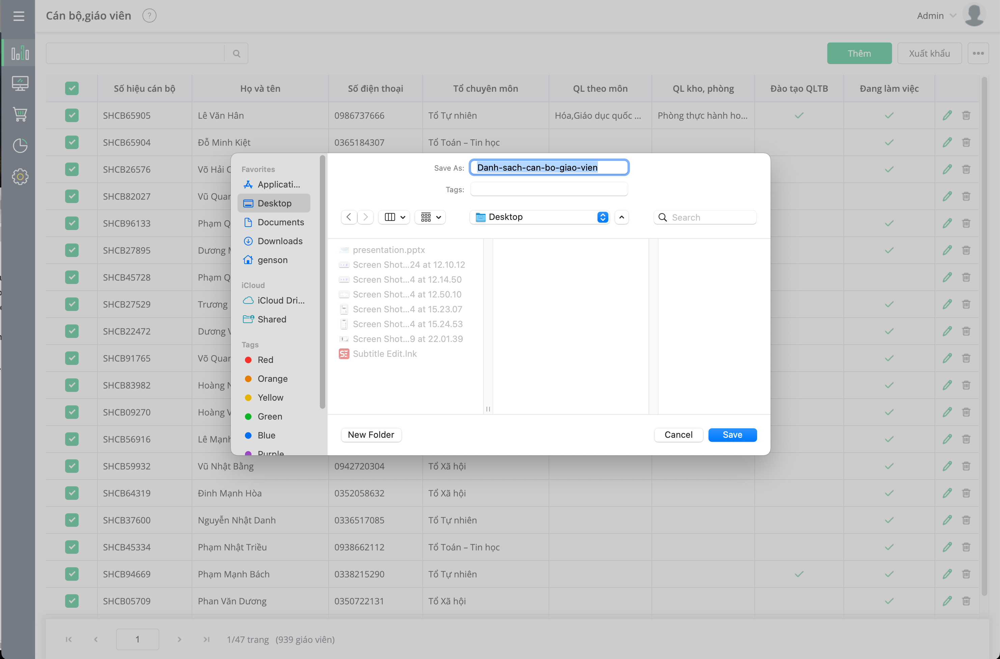

